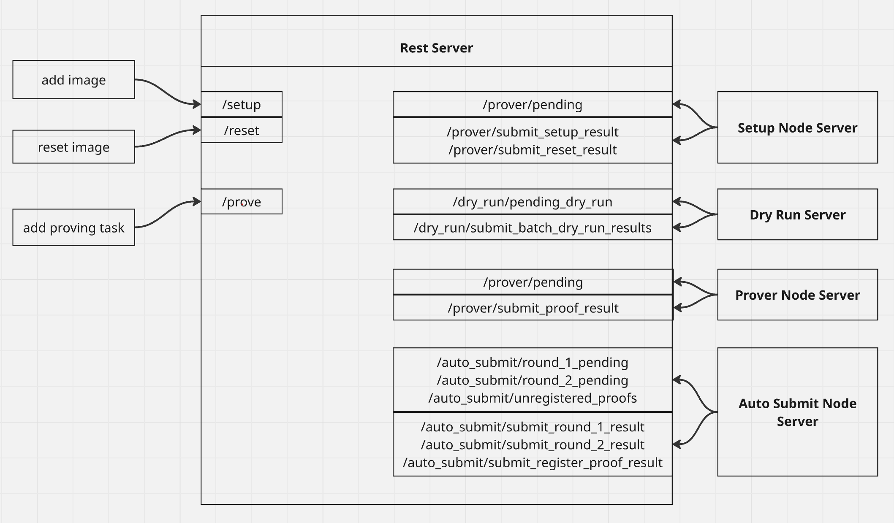

# ZKWasm Playground

## Overview

This document provides an overview of the ZKWasm Playground (ZKP), a platform for running and verifying Zero-Knowledge Proofs
(ZKPs) of WebAssembly (WASM) programs.

At its core, the ZKP project is built on two key ideas:

- Images: a WASM binary compiled from a program. It receives inputs through a `C` FFI defined in the
  [zkwasm-rust-sdk](https://github.com/DelphinusLab/zkWasm-rust/blob/main/src/lib.rs).

- Proofs: the verifiable output generated when an image runs with given inputs. Proofs allow anyone to confirm the result was
  computed honestly.

For background material, see the [official documentation](https://zkwasmdoc.gitbook.io/delphinus-zkwasm/).

This guide is written for new developers and focuses on understanding the Proofs-as-a-Service platform.

______________________________________________________________________

## Servers

The platform is made up of several servers.

- Core servers: required to run the main ZKP workflow.
- Additional servers: used in production, but not needed for basic functionality.

### Core Servers

#### Rest Server

The Rest Server is the central orchestrator.

- Exposes API endpoints for creating and triggering proofs.
- There is exactly one Rest Server per deployment.
- Only the Rest Server has direct access to the database.
- Its configuration (`server_config.json`) must include the addresses of other servers.
- Each server also requires an Ethereum wallet address, typically managed with MetaMask.

#### Setup Node Server

The Setup Node Server handles WASM images. Before proofs can run, an image must be registered in the system:

- Validates and checks the image.
- Inserts metadata into the database.
- Stores the binary on the local file system.

The Setup Node's address must be listed in `server_config.json`.

#### Dry Run Server

The Dry Run Server runs an image with given inputs before a proof is attempted. Its roles are:

1. Verify the program executes without errors.
1. Update state in the Merkle database.

Notes:

- It uses Merkle database FFIs provided by the [zkwasm-rust-sdk](https://github.com/DelphinusLab/zkWasm-rust).
- It has direct access to the Rest Server's Merkle database.
- Dry Runs are executed in FIFO order, ensuring state updates remain consistent.
- Once Dry Run completes, proofs can be processed in any order.

#### Prover Node Server

The Prover Node Server performs the proving work.

- Multiple provers can be connected to the cluster.
- Each prover is listed in `server_config.json`.
- A prover picks up tasks and generates proofs for the corresponding inputs.

#### Auto Submit Node Server

The Auto Submit Node Server batches multiple proofs into a single verification step on Ethereum. This helps reduce gas fees by
combining submissions.

### Additional Servers

#### Archive Server

The Archive Server manages historical data.

- Moves old task records from the main database into a separate archive database.
- Reduces the size of the main history database.

#### Backup Server

The Backup Server maintains redundancy for Dry Run state (Merkle data).

- Runs a secondary Dry Run process for backup purposes.
- Critical because Merkle data represents user state.
- For older systems, `MongoDB` Replica Sets are used for database backup.

______________________________________________________________________

## Core Service Overview

.

The diagram shows how the core services work together:

- The Rest Server manages the lifecycle of tasks, handling requests and updating the database.
- Prover Servers poll the Rest Server for new tasks.
- Supported task types include adding, resetting, or proving an image.

### Request lifecycle

Add/Reset image request:

```markdown
Add/Reset image -> rest server -> Setup/Reset Pending -> Setup Node Server -> Submit result
```

Add prove task request:

```markdown
Add prove -> rest server -> Dry Run Pending -> Dry Run Server -> Submit result ------
                                                                                    |
                               Submit result <- Prove Server <- Prove Pending  <-----
```
