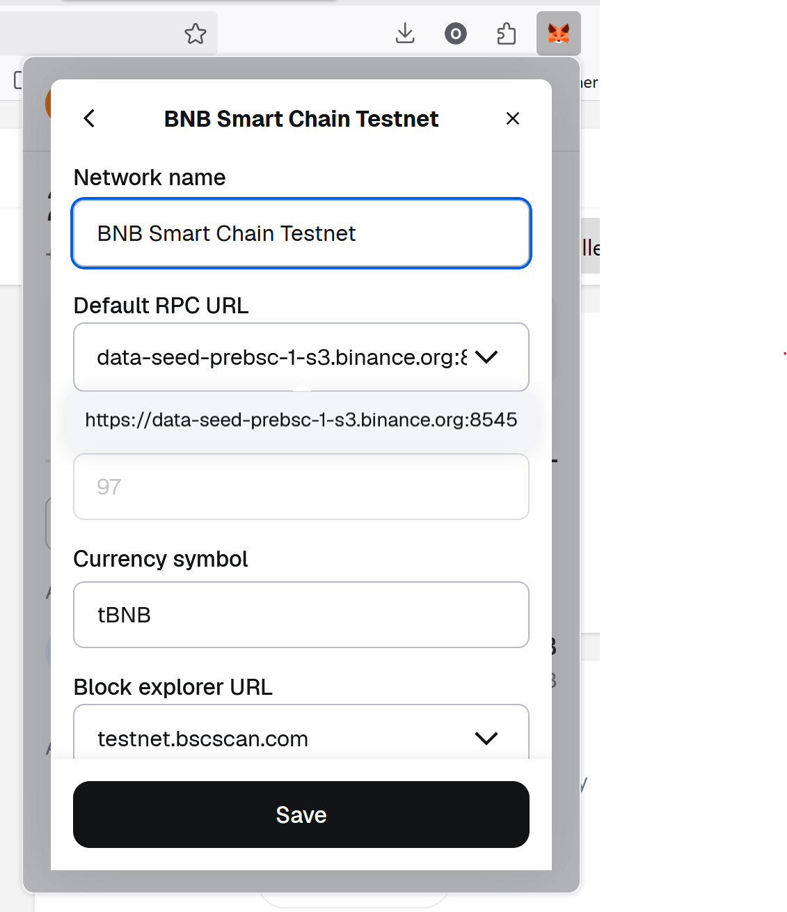

# ZKWasm Playground Developer Setup

The [ZKWasm Playground (ZKP)](https://github.com/ZhenXunGe/zkWASM-playground) requires a beefy setup for complete system running.
Only compilation, formatting, linting and unit tests can be done locally. For testing, using the developer server machines are
required.

The following guide focuses on setting up the dev environment for testing on a developer server.

## MetaMask Setup

Before must create a [MetaMask](https://metamask.io/) account and install the browser extension.

Once your create your MetaMask account you can create multiple wallets each with a unique address and private key. Make sure you
note these down, the address/key must be provided

## Initial Setup

### 1. Tmux session

Tmux is used for running multiple processes at once.

Start a new tmux session

```bash
tmux new
```

### 2. Clone Repo

Create a parent folder `zkp` and clone the Repo into two directories; specific services can be grouped into a shared directory.

1. `restservice` for Rest and Dry Run services
1. `proveservice` for Prover, Setup and Auto Submit Nodes.

```bash
mkdir zkp
cd zkp
git clone git@github.com:ZhenXunGe/zkWASM-playground.git restservice
git clone git@github.com:ZhenXunGe/zkWASM-playground.git proveservice
```

### 3. Update Rest Service Config and Scripts

First change directory into `restservice`.

```bash
cd restservice
```

Get your addresses from MetaMask. You need a unique address for Rest server, Prover Server, Setup Node.

The network details can be stored in `MetaMask`, usually details can be found on [chainlist](https://chainlist.org).

.

#### Server Config

Modify the following are the important variables in `restservice` config:

##### Main Server Config Changes

`server_config.json`:

```json
{
   "deployer_privkey": "$REPLACE_WITH_YOUR_METAMASK_NODE_PRIVATE_KEY",
   "deployer_address": "$REPLACE_WITH_YOUR_METAMASK_NODE_ADDRESS",
   "receiver_address": "$REPLACE_WITH_YOUR_METAMASK_NODE_ADDRESS",
   "mongodb_uri": "mongodb://localhost:$REPLACE_WITH_MONGODB_PORT",
   "view_internal_logs_addresses": [
     "$REPLACE_WITH_YOUR_METAMASK_NODE_ADDRESSES",
     ...
   ],
   "prover_addresses": [
     "$REPLACE_WITH_SETUP_NODE_ADDRESSES",
      ...
   ],
   "dry_run_address": "$REPLACE_WITH_DRY_RUN_ADDRESS",
   "init_dry_run_task_id": "$REPLACE_WITH_INIT_DRY_RUN_TASK_ID",
   "prover_grading_options":{
     "heartbeat_task_address": "$REPLACE_WITH_HEARTBEAT_SERVICE_ADDRESS",
     "init_prover_grading_task_id": "$REPLACE_WITH_INIT_PROVER_GRADING_TASK_ID_OR_NONE",
   },
   "topup_token_params": {
     "token_address": "$REPLACE_WITH_TOKEN_ADDRESS",
     "network_id": $REPLACE_WITH_TOKEN_ADDRESS_NETWORK_ID,
   },
   "setup_node_addresses": ["$REPLACE_WITH_SETUP_NODE_ADDRESSES"],
   "deploy_node_addresses": ["$REPLACE_WITH_DEPLOY_NODE_ADDRESSES"],
   "auto_submit_config": {
     "supported_network_ids": [$REPLACE_WITH_TOKEN_ADDRESS, ...]
   },
   "auto_submit_node_list": [
     {
       "address": "$REPLACE_WITH_AUTO_SUBMIT_NODE_ADDRESSES",
       "chain_id": $REPLACE_WITH_TEST_NET_CHAIN_ID_NUMBER
     },
     ...
   ],
   "administrator_addresses": [
     "$REPLACE_WITH_YOUR_METAMASK_NODE_ADDRESS",
     ...
   ],
   "network_list": [
    {
      "chain_id": $REPLACE_WITH_TEST_NET_CHAIN_ID_NUMBER,
      "chain_name": "$REPLACE_WITH_TEST_NET_CHAIN_NAME",
      "block_explorer_url": "$REPLACE_WITH_TEST_NET_BLOCK_EXPLORER_URL",
      "rpc_url": "$REPLACE_WITH_TEST_NET_RPC_URL",
      "native_currency": {
        "name": "$REPLACE_WITH_TEST_NET_CURRENCY_NAME",
        "symbol": "$REPLACE_WITH_TEST_NET_CURRENCY_SYMBOL",
        "decimals": $REPLACE_WITH_TEST_NET_CURRENCY_DECIMALS
      },
    },
    ...
   ]
}
```

##### Network Config Changes

Example Network config changes in `server_config.json`:

```json
{
   "network_list": [
        {
          "chain_id": 97,
          "chain_name": "bsctestnet",
          "block_explorer_url": "https://testnet.bscscan.com",
          "rpc_url": "https://data-seed-prebsc-1-s3.binance.org:8545",
          "native_currency": {
            "name": "Test BNB",
            "symbol": "tBNB",
            "decimals": 18
          },
          "deploy_fee": "0.003",
          "deploy_strategy": "usemaxfeepergas"
        },
        ...
   ]
}
```

#### Dry Run Config

The following are the key variables that must be updated in the dry run config file:

- Server URL must be set to point to your Rest server.
- Private key must be set to your own private key from MetaMask.
- Address must be set to your MetaMask address, should match the private key and be the same as used in rest server config.

`dry_run_config.json`:

```json
{
  "server_url": "http://localhost:$REPLACE_WITH_REST_SERVER_PORT",
  "private_key": "$REPLACE_WITH_YOUR_METAMASK_NODE_PRIVATE_KEY",
  "address": "$REPLACE_WITH_YOUR_METAMASK_NODE_ADDRESS"
}
```

#### Update Deploy Options for Manual Mode Network

Adjust to the name of your network in the deploy options.

`server_storage/deploy/deploy_options.json`:

```json
{
  "$REPLACE_WITH_TEST_NET_CHAIN_NAME": {
    "from_circuit_size": 22,
    "to_circuit_size": 22
  }
}
```

#### Update Deploy Options for Auto Submit Mode Network

Adjust to the name of your network in the auto submit deploy options.

`auto_submit_workspace/deploy/auto_submit_deploy_options.json`:

```json
{
  "$REPLACE_WITH_TEST_NET_CHAIN_NAME": {
    "from_circuit_size": 23,
    "to_circuit_size": 23
  }
}
```

#### Update Run Script

Adjust to the your local port which is available. This is where API requests are received.

`run.sh`:

```bash
RUST_LOG=info cargo run --release --features profile -- --config server_config.json -w server_storage --rocksdbworkspace rocksdb --restport $REPLACE_WITH_REST_SERVER_PORT
```

#### Update `MongoDB` Script

Adjust to the another local port which is available. This is where `MongoDB` will accept requests.

`run_mongodb_replica_set.sh`:

```bash
mongod --port $REPLACE_WITH_MONGODB_PORT --dbpath db --replSet rs0 \
    2>&1 | rotatelogs -e -n 10 logs/db/db_$time.log 100M
```

#### Web GUI Env Variables

Update the Port and Rest URL variables in web environment file.

`web/.env`:

```bash
$PORT=$REPLACE_WITH_YOUR_EXPOSED_PORT_FOR_WEB_PAGE
$REACT_APP_REST_URL='http://localhost:$REPLACE_WITH_REST_SERVER_PORT'
```

### 4. Update Prover Service Configs and Scripts

Change into `proveservice` directory.

```bash
cd proveservice
```

Get your addresses from MetaMask. You need a unique address for Prover Server and Setup Node.

#### Update Prover Config

Update the following key variables in the prover config file:

- Server URL must be set to point to your Rest server.
- Private key must be set to one of your private keys. This must be different to the private key/address assign to the rest
  server.

`prover_config.json`:

```json
{
  "server_url": "http://localhost:$REPLACE_WITH_REST_SERVER_PORT",
  "priv_key": "$REPLACE_WITH_YOUR_METAMASK_NODE_PRIVATE_KEY",
  ...
}
```

#### Update Prover System Config

The prover system config only requires the rest server url to be updated.

`prover_system_config.json`:

```json
{
  "server_url": "http://localhost:$REPLACE_WITH_REST_SERVER_PORT",
  ...
}
```

#### Setup Node Config

Adjust the setup node config to point to a separate config with specific setup details. Follow the same steps
[here](#update-prover-config) but specify a different private key and address pair. Creating a new account with your MetaMask will
generate a new address/key pair.

Additionally, you will need to create a new directory for setup node server data (e.g. `workspace_1`), it cannot share the same as
prover.

`run_setupnode.json`:

```bash
RUST_LOG=info RUST_BACKTRACE=1 cargo run --release --features profile -- --config $SETUP_NODE_PROVER_CONFIG --proversystemconfig prover_system_config.json -w $SETUP_NODE_WORKSPACE -s
```

#### Auto Submit Config

Update the key variables in the auto submit config.

- Server URL must be set to point to your Rest server.
- Private key must be set to specific key for auto submit service (generated from MetaMask).
- Network must be set to the test chain in which the generated batches will be verified on.

`auto_submit_config.json`:

```json
{
    "server_url": "http://localhost:$REPLACE_WITH_REST_SERVER_PORT",
    "private_key": "$REPLACE_WITH_YOUR_AUTO_SUBMIT_NODE_PRIVATE_KEY",
    "network": {
        "chain_id": $REPLACE_WITH_TEST_NET_CHAIN_ID_NUMBER,
        "rpc_url": "$REPLACE_WITH_TEST_NET_RPC_URL"
    },
}
```

### 5. Run Server Prepare Script

Now, each tmux screen in the session will be dedicated to a specific service in the deployment.

In your tmux screen which is dedicated to Rest Server, run the preparation script, this will take ~30 minutes to complete. Ensure
you enter "Yes" to the prompts.

```bash
bash scripts/deployments/prepare/perform_server_setup.sh
```

Copy the K Params files into prover, and setup node server directories. Note: Auto submit will download K params and
[dockerized prover](/guides/prover-node-docker/README.md) has them built in.

```bash
# Copy into prover node data directory
mkdir -p ../proveservice/workspace/static && cp ./server_storage/static/K2* ../proveservice/workspace/static/

# Copy into setup node data directory (here it is just called `workspace_1`)
mkdir -p ../proveservice/workspace_1/static && cp ./server_storage/static/K2* ../proveservice/workspace_1/static/
```

### 6. Start Services

Start the service, in each its own tmux screen.

1. `MongoDB` (note: `rs.initiate()` command is required to be run if the DB is newly created)

   ```bash
   bash run_mongodb_replica_set.sh
   ```

1. Rest Server

   ```bash
   bash run.sh
   ```

1. Dry Run Server

   ```bash
   bash run_rest_dry_run_service.sh
   ```

1. Prover Server

   ```bash
   bash runprover.sh
   ```

1. Setup Node Server

   ```bash
   bash run_setupnode.sh
   ```

1. Auto Submit Server

   ```bash
   bash run_auto_submit.sh
   ```

### 7. Start Web GUI

Install dependencies

```bash
npm install
```

Run

```bash
npm run start
```

### 8. Testing, Formatting and Linting

#### Unit Testing

Most basic tests, excludes testing prove and database functionality.

```bash
cargo tests
```

#### System Testing

This script runs tests that verifies setup and prove functionality, requires the prepare script to have been run.

```bash
bash scripts/tests/test_all.sh
```

#### E2E Testing

[see guide here](../zkwasm-e2e-testing/README.md)

#### Formatting

```bash
# Rust code format
cargo fmt

# Web code format
cd web && npm run format && cd ..
```

#### Linting

```bash
cargo lint
cargo lint_tests
```
